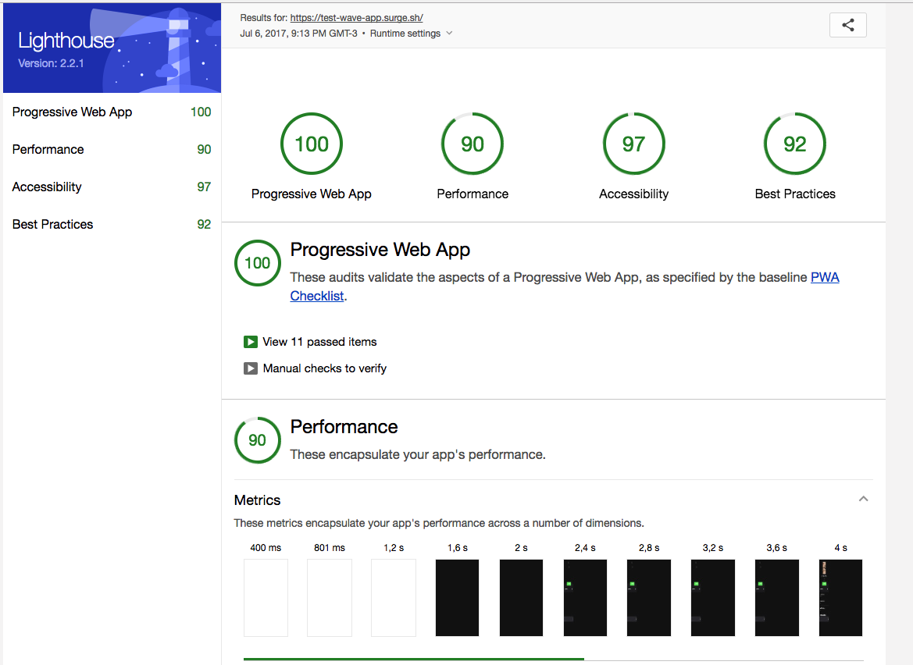
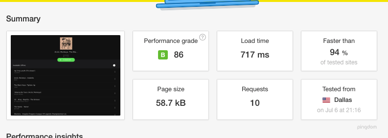

# Wave-pwa

<a align="center" href="https://test-wave-app.surge.sh/">  </a>

[](https://travis-ci.org/vitormalencar/wave-pwa)
[](https://codeclimate.com/github/vitormalencar/wave-pwa) [](https://greenkeeper.io/)

SoundCloud PWA client built with Preact, Redux, and Redux Observable. Try the [live demo](https://test-wave-app.surge.sh/).

# Stack:
  - Preact
  - React-Router
  - Redux
  - Redux-Observables
  - React-Helmet
  - Sass
  - SW-Precache
  - Webpack Dashboard(For Bundle Analysis)


# Features
  - Offline Caching (via serviceWorker)
  - Asset Versioning (aka "cache-busting")
  - ES2015 (ES6) and ES2016 (ES7) support
  - Webpack Bundle Analysis (see dashboard)
  - Hot Module Replacement (HMR) for all files
  - Preact's Developer Tools
  - Lighthouse certified

  ## Lighthouse  
  
  ## pingdom
  

# JS Build files
 - app.js - 246kb (17kb gzipped)
 - vendor.js - 441kb (8.04kb gzipped) :rocket:

# Quick-Start Guide

- [Installation](#installation)
- [Development Workflow](#development-workflow)

## Installation

**1. Clone this repo:**

```sh
git clone https://github.com/vitormalencar/wave-pwa.git
cd wave-pwa
```


**2. Install the dependencies:**

```sh
yarn install
```

> You're done installing! Now let's get started developing.


## Development Workflow


**3. Start a live-reload development server:**

```sh
yarn run dev
```

> This is a full web server nicely suited to your project. Any time you make changes within the `src` directory, it will rebuild and even refresh your browser.

> :information_source: Try to avoid using Service Worker in your development environment, so you won't need to hard reload the page anytime you make a change.

**4. Generate a production build in `./build`:**

```sh
yarn run build
```

You can now deploy the contents of the `build` directory to production!

## License

MIT
